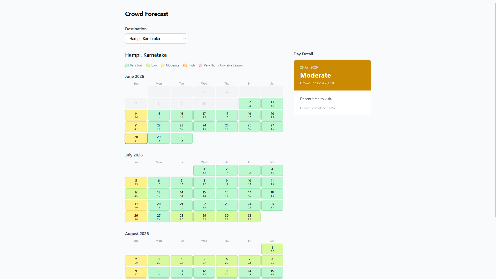

# Crowd Forecaster

A simple web application that predicts crowd levels at popular Indian travel destinations. It uses historical search interest and calendar data to help you users know how busy a location will be.

## Live Links

* Frontend: https://crowd-forecast.vercel.app
* Backend API: https://crowd-forecast-production.up.railway.app/health

## Features

* 120-day daily crowd forecasts for destinations like Manali, Goa, Rishikesh, Coorg, and Hampi.
* Crowd index scoring from 1 to 10 (categorized from "Very Low" to "Very High/Unviable").
* Accounts for major Indian holidays, seasonal travel patterns, and off season months.
* Caches data to ensure fast load times.

## Tech Stack

* Backend: Python, FastAPI, Prophet, Google Trends
* Frontend: React, TypeScript, Vite
* Hosting: Vercel (Frontend), Railway (Backend)

Note: The first time you select a destination, the application takes some time to fetch data and train the model. After that, it loads immediately (caching).
